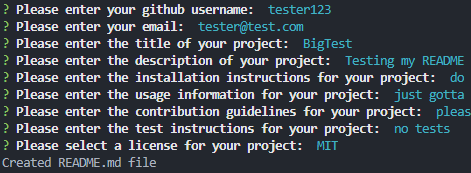

# README Generator

## Table of Contents
- [Description](#description)
- [Installation](#installation)
- [Usage](#usage)
- [Technologies Used](#technologies)
- [License](#license)
 

## Description
This is an application used to generate a README.md file for any project repository.
 

## Installation
Clone the repository and ensure you have Node.js installed.  
Once you've done that, open the terminal and run `npm install` to install the dependencies.
 

## Usage
[Link to video walkthrough]()  

Make sure you have Node.js Installed.  
Run `node index.js` to start the program  

## Technologies

- VS Code  
- NodeJS  
- Inquirer  

## License
The code in this project is licensed under MIT license.